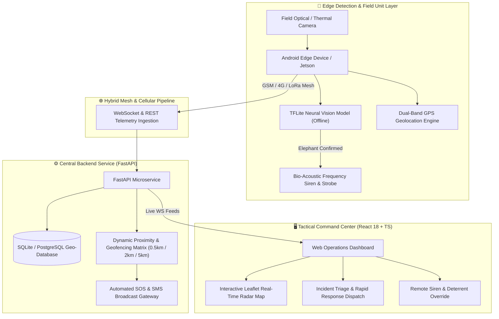

<div align="center">

# 🐘 ELEPHANT GUARD (SEEMS-AI)
### Smart Early Warning, Edge AI Detection & Acoustic Deterrence Ecosystem for Human-Elephant Conflict Mitigation

[](https://opensource.org/licenses/MIT)
[](https://fastapi.tiangolo.com)
[](https://reactjs.org/)
[](https://www.typescriptlang.org/)
[](https://developer.android.com/)
[](https://www.tensorflow.org/lite)
[](https://www.docker.com/)

<p align="center">
  <b>A comprehensive, edge-to-cloud wildlife defense and early-warning intelligence platform designed to eliminate human-elephant casualties through real-time edge computer vision, automated non-invasive acoustic deterrence, and instantaneous tactical dispatch.</b>
</p>

---

</div>

## 📌 Problem Overview & Motivation

Human-Elephant Conflict (HEC) causes hundreds of fatalities and widespread agricultural devastation annually across elephant corridor zones. Traditional mitigation strategies (manual watchtowers, basic electric fences, late-stage SMS alerts) suffer from:
1. **High Latency**: Detection often occurs only after herds enter agricultural or residential perimeters.
2. **False Alarms & Power Depletion**: Cloud-dependent video streaming drains field battery units and fails in zero-connectivity forests.
3. **Invasive or Ineffective Deterrence**: Firecrackers and physical barriers cause panic or long-term behavioral habituation.

**Elephant Guard (SEEMS-AI)** solves this with a **zero-latency, offline-capable Edge AI perception network** coupled with automated multi-frequency bio-acoustic deterrence and an integrated military-grade tactical command dashboard.

---

## 🏛️ System Architecture



---

## 🚀 Key Modules & Capabilities

### 1. 📱 Edge AI Mobile Application (`/mobile-app`)
- **Native Android Architecture**: Built in Kotlin using Jetpack Compose, CameraX, and Android Architecture Components.
- **On-Device Vision Inference**: Executes quantized TensorFlow Lite neural network models directly on edge hardware with sub-100ms inference times.
- **Automated Defensive Triggers**: Directly drives connected speaker arrays with tailored acoustic frequencies upon confident detection.
- **Offline Resilient**: Buffers geolocated incidents in local Room storage and synchronizes automatically upon cellular/mesh recovery.

### 2. 🖥️ Tactical Web Command Center (`/dashboard`)
- **High-Contrast Dark Mode UI**: Engineered for tactical night-vision and 24/7 command operations with Tailwind CSS & Lucide icons.
- **Real-Time Radar & Conflict Map**: Live GPS telemetry plots elephant herds, patrol teams, warning zones, and historical migration heatmaps with Leaflet.
- **Incident Lifecycle Management**: End-to-end incident logging, triage escalation, and challenge/solution documentation workflows.
- **Instant SOS Broadcast**: One-click and automated emergency broadcast triggers alerting local forest rangers and village leaders.

### 3. ⚙️ AI Alert & Telemetry Backend (`/backend`)
- **FastAPI Core**: Asynchronous, high-throughput backend handling live WebSocket streams and REST APIs.
- **Role-Based Security**: Complete JWT-based authentication system separating Rangers, Commandants, and Admin Supervisors.
- **Proximity Geofencing Calculator**: Computes multi-stage buffer zones (Critical: <0.5km, High: <2km, Caution: <5km) to eliminate false positives.

### 4. 📚 Comprehensive Technical Dossiers & PPTX (`/docs`)
- **Master Technical Specifications PDF**: Deep technical whitepaper detailing hardware selection, acoustic frequency response curves, power budgets, and solar harvesting profiles.
- **Winning Presentation PPTX & Guide**: Official presentation slide deck, speaker notes, and jury defense manual.

---

## 📁 Repository Structure

```text
ElephantGuard/
├── .github/
│   └── workflows/
│       └── ci.yml                     # Continuous Integration workflow (FastAPI + React)
├── backend/                           # FastAPI AI, Alert & Telemetry Backend
│   ├── auth.py                        # JWT security, password hashing, RBAC
│   ├── database.py                    # Database schema, migrations & seed data
│   ├── main.py                        # REST routes, WebSockets & SOS dispatcher
│   ├── models.py                      # Pydantic schemas & data models
│   ├── requirements.txt               # Backend dependencies
│   ├── Dockerfile                     # Containerization image
│   └── README.md
├── dashboard/                         # Tactical React + TypeScript Command Center
│   ├── src/
│   │   ├── auth/                      # Authentication context & providers
│   │   ├── components/                # RealTimeMap, IncidentModal, SystemStatus
│   │   ├── pages/                     # AdminDashboard, CommandOverview, Login
│   │   └── services/                  # REST and WebSocket API clients
│   ├── public/                        # Static assets & icons
│   ├── package.json                   # Dependencies & scripts
│   ├── tsconfig.json                  # TypeScript configuration
│   ├── vite.config.ts                 # Vite bundler configuration
│   ├── tailwind.config.js             # Styling configuration
│   ├── Dockerfile                     # Nginx production build image
│   └── README.md
├── mobile-app/                        # Native Android Kotlin Edge Detection App
│   ├── app/                           # App module (CameraX, TFLite, Compose)
│   ├── gradle/                        # Gradle wrapper files
│   ├── build.gradle.kts               # Build configuration
│   ├── settings.gradle.kts            # Project settings
│   ├── gradlew & gradlew.bat          # Build scripts
│   └── README.md
├── docs/                              # SIH Winning Technical Dossier & Presentations
│   ├── Elephant_Guard_Complete_Technical_Specification.pdf
│   ├── Elephant_Guard_SIH26043_Complete_Master_Guide.pdf
│   ├── Elephant_Guard_SIH26043_Full_Presentation_Dossier.pdf
│   ├── Elephant_Guard_SIH26043_Winning_Presentation.pptx
│   ├── SIH_Elephant_Guard_Ultimate_Presentation_Guide.pdf
│   ├── SIH_Elephant_Guard_Ultimate_Defense_Guide.md
│   └── Elephant_Guard_SIH_PPT_Complete_Slide_Deck.md
├── scripts/                           # Presentation & PDF Document Generators
│   ├── generate_winning_pptx.py
│   ├── generate_single_master_pdf.py
│   ├── generate_ultimate_sih_guide.py
│   └── generate_comprehensive_sih_dossier.py
├── docker-compose.yml                 # 1-Click local launch for Backend + Dashboard
├── .gitignore                         # Multi-tier git exclusion rules
├── LICENSE                            # MIT License
└── README.md                          # Project master documentation
```

---

## ⚡ Quick Start Guide

### Option 1: One-Click Docker Compose (Recommended)

To start both the Backend API and Web Command Dashboard simultaneously:

```bash
# Clone the repository
git clone https://github.com/your-username/ElephantGuard.git
cd ElephantGuard

# Start all services
docker compose up --build
```

- **Tactical Dashboard**: [http://localhost:3000](http://localhost:3000)
- **FastAPI Backend**: [http://localhost:8000](http://localhost:8000)
- **Swagger API Docs**: [http://localhost:8000/docs](http://localhost:8000/docs)

---

### Option 2: Local Manual Setup

#### 1. Backend Service
```bash
cd backend
python -m venv venv
# Linux/macOS:
source venv/bin/activate
# Windows:
.\venv\Scripts\activate

pip install -r requirements.txt
uvicorn main:app --reload --host 0.0.0.0 --port 8000
```

#### 2. Tactical Web Dashboard
```bash
cd dashboard
npm install
npm run dev
```

#### 3. Native Android App
Open the `mobile-app` directory in **Android Studio** (Hedgehog or newer) and click **Run** on your connected device or emulator.

---

## 🛠️ Technology Stack

| Tier | Technologies |
| :--- | :--- |
| **Edge AI Perception** | TensorFlow Lite, OpenCV, CameraX, Dual-Band GNSS / GPS |
| **Mobile Runtime** | Kotlin, Android Jetpack Compose, Coroutines, Flow |
| **Backend & Microservices** | Python 3.11, FastAPI, Uvicorn, SQLite / SQLAlchemy, Pydantic |
| **Tactical Dashboard** | React 18, TypeScript, Vite, Tailwind CSS, Leaflet, Lucide Icons |
| **Real-Time Streaming** | Asynchronous WebSockets, Server-Sent Events (SSE) |
| **DevOps & Containers** | Docker, Docker Compose, GitHub Actions CI/CD |

---

## 📄 License

This project is licensed under the **MIT License** — see the [LICENSE](LICENSE) file for details.

---

<div align="center">
  <sub>Built with ❤️ for Wildlife Conservation & Forest Department Field Officers.</sub>
</div>
